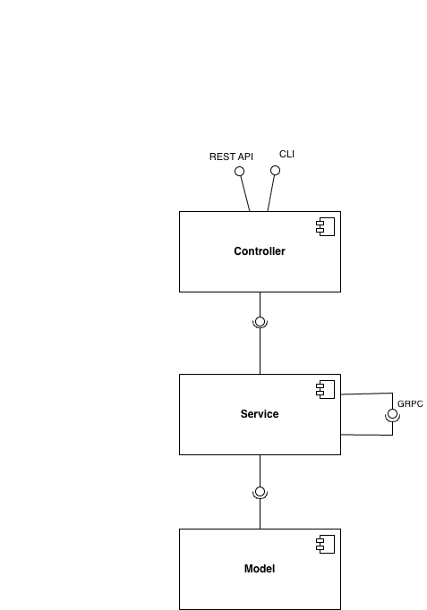
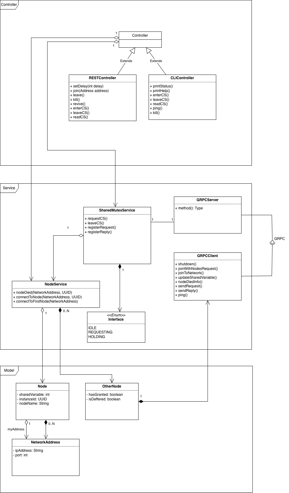
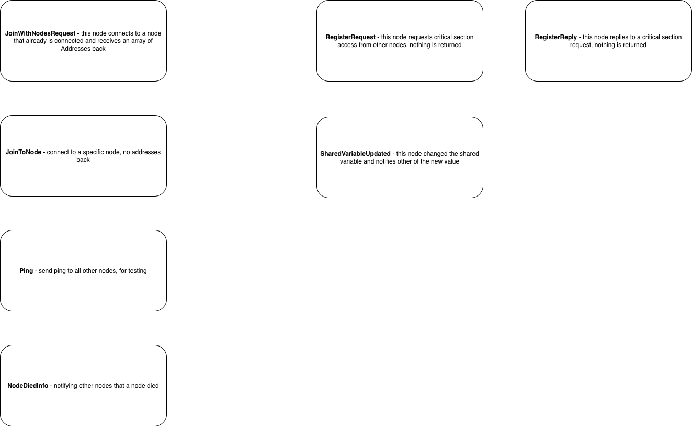

# Carvalho–Roucairol Distributed Mutual Exclusion Algorithm

This repository contains an implementation of the Carvalho–Roucairol distributed mutual exclusion algorithm, 
which ensures that only one instance may enter the critical section at a time and modify the shared variable.

## System Architecture

The system follows a layered architecture consisting of three layers:
1. Controller -Handles external communication and coordinates incoming requests.
2. Service - Contains the core logic of the algorithm.
3. Model - Represents the data and state maintained by the system.

## Class Diagram

The following class diagram shows the main components and how they relate to each other, 
highlighting the separation of concerns between layers.

## gRPC Schema

Instances of the algorithm communicate with each other using gRPC.
The schema defines all procedures required for coordination, along with explanations of their roles in maintaining distributed mutual exclusion.

